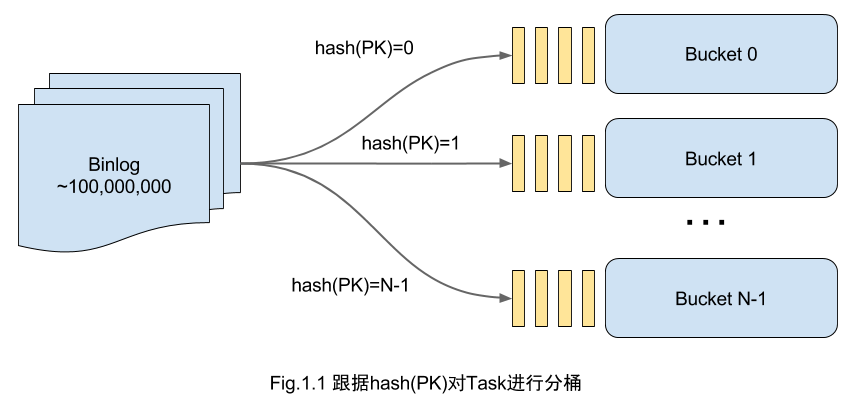
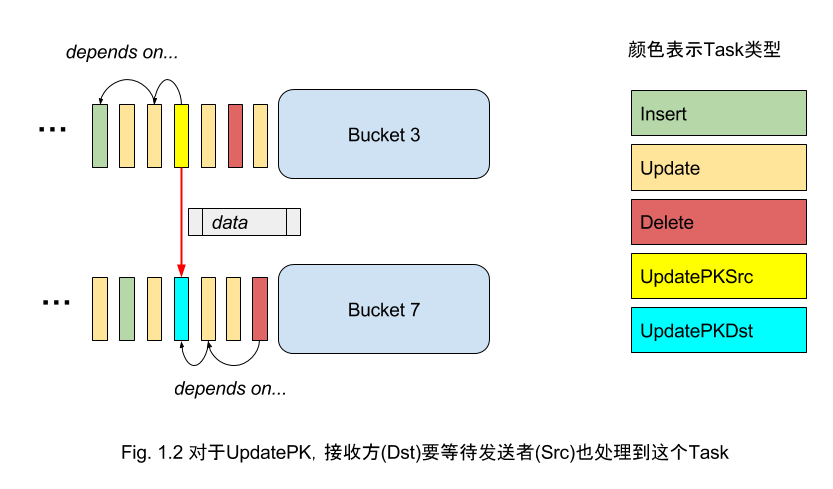
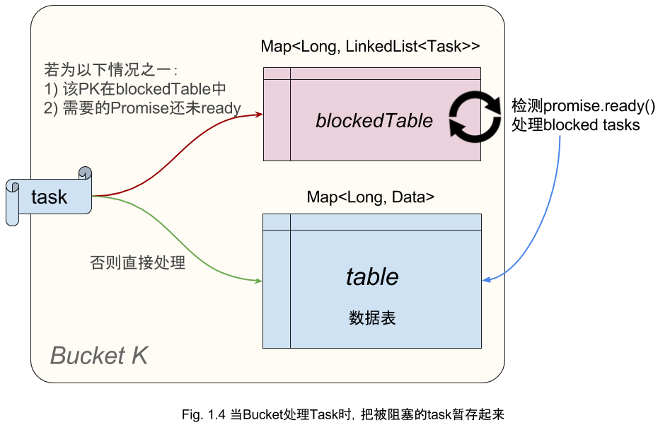
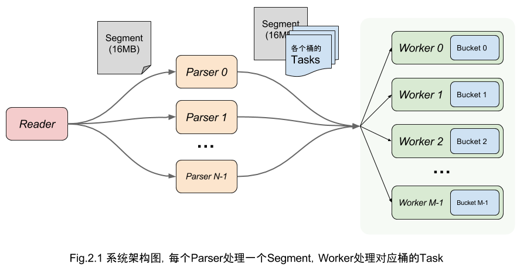
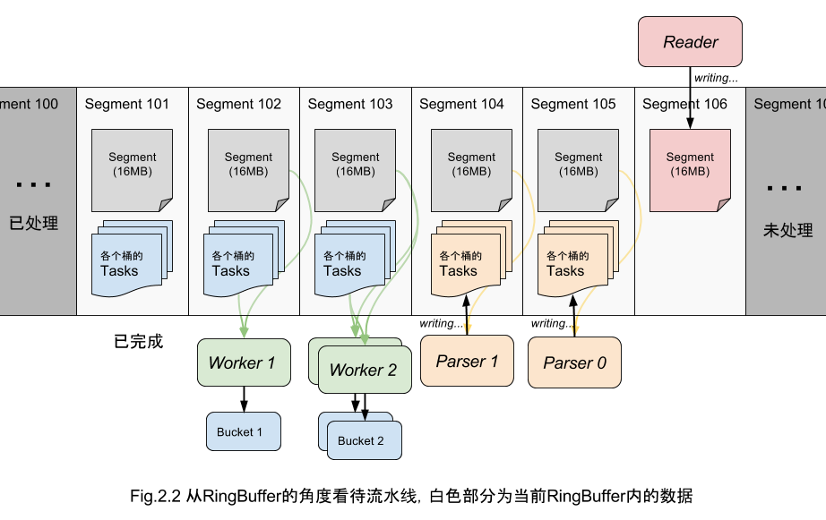

IncrementalSync 工程设计文档
====================================

> BY：傅宇（fuyufjh）吴迪（vettal）

[toc]

<div style="page-break-after: always;"></div>

# 算法设计

> **问题回顾**：给定一批固定的增量数据变更信息，程序需要进行数据重放计算，然后将最终结果输出到给定的目标文件中。增量数据的变更主要包含数据库的 Insert/Update/Delete三种类型的数据。主键可能发生变更。

## Hash 分桶

为了发挥并行性能，我们把数据表按 hash(PK) 切分成 N 个 Bucket。



对于Insert，Delete 和一般的 Update 事件，只要分到对应的 Bucket 去做就可以了；唯独 UpdatePK（更新主键）事件例外，**必须要 Bucket 间协作才能保证正确地把数据移动过去**。


> 何谓“Bucket 间协作”？
>
> 一行数据被“拿走”的时候，如果还有些对该行的操作没完成，那这些修改就丢失了！所以，必须要保证一行数据被“拿走”前，所有的修改都已经 apply 到上面。反之同理，必须要“拿到”数据以后，才能把后续的操作 apply 上去。
> 
> 也就是说，我们要让这两个线程在这一点（UpdatePK 这条操作）上“同步”才行。



很自然的想到，可以用 CountDownLatch 来阻塞 UpdatePK 的接收方（数据被移到此 Bucket），直到 UpdatePK 的发送方发出这行数据，它才拿到数据、接着运行。

然而，当 UpdatePK 操作较为密集的时候，这个解决方案非常低效！有什么解决方法呢？

## Promise

**本算法的核心在于通过 Promise 对象，解决了 Update 主键这一难题，从而使得数据表的各个 Bucket 的线程能够无锁、高效地协作。**

所谓 Promise，是借鉴 Future/Promise 异步编程范式设计的一个数据结构。实现很简单，只要封装一个 volatile 的变量，如下所示（实际代码实现更复杂，仅为示例）：

```java
final class Promise<T> {
    volatile T data;
    
    public boolean ready() { return data != null; }
    public T get() { return data; }
    public void set(T data) { this.data = data; }
}
```

Promise 在 parse 到 UpdatePK 事件时产生，发送方和接收方都持有它的引用：发送方获得 *UpdatePKSrc* 任务，只能写入Promise（`set`）；接收方获得 *UpdatePKDst* 任务，只能读取Promise（`get`）、以及检查数据是否 ready。通过 Promise 作为中间媒介，被操作的数据记录 data 就能从源 Bucket：hash(srcKey) 移动到目标 Bucket：hash(dstKey)。


相比上一小节提到的 Latch 解决方案，Promise 不是阻塞接收方，而是告诉他：你要的数据还没准备好。明智的接收方将会**先“搁置”这个消息，并把后来遇到的所有对这个 Key 的操作都暂存起来**。一旦某一时刻 Promise.ready() 为真，就可以把这个 data 放到对应的 Key 上了！暂存的操作也可以那时候再做。

> 如何从 blockedTable 中高效的找到 promise.ready() 的 task？事实上对于每个发送者（也就是其他bucket），我们只要检查最早阻塞的那个 task 是否 ready 就可以了。
 


> 对被 block 的 PK 的操作，会以一个链表保存下来。如果不巧操作很多，这个链表就会变的很长。一个简单的改进：如果来的是一个普通 Update 操作，其实可以直接 apply 到上一个操作上的 data 上，例如 `A=5 B=6` 可以叠加到 `PK=3 A=4`上， 就变成 `PK=3 A=5 B=6`，从而避免把 Update 操作追加到链表上。

附上关键逻辑的伪代码：

```java
// 当 Parse 到 UpdatePK (SET PK=dstKey WHERE PK=srcKey)
Promise promise = new Promise();
bucket[hash(srcKey)].send(new UpdatePKSrcTask(srcKey, promise, ...));
bucket[hash(dstKey)].send(new UpdatePKDstTask(dstKey, promise, ...));
```

```java
// 当接收方 Bucket 收到 UpdatePKDstTask task
if (!task.promise.ready()) {
	LinkedList<Task> blockedTasksOnThisKey = new LinkedList<>(); // 存放暂存的 Task
	blockedTasksOnThisKey.add(task);
	blockedTable.put(task.key, blockedTasksOnThisKey); // 暂存，以后再处理
} else {
	table.put(task.key, task.getData()); // 直接处理
}
```

```java
// 当发送方 Bucket 收到 UpdatePKSrcTask task
task.promise.set(table.remove(key));
```

```java
// 当接受方发现 blockedTable 中的 task.promise 已经 ready，则取出来处理掉
for (Task task : blockedTasks) {
	applyUnblockedTask(task);
}
```

> 如果阻塞的 Tasks 中包含一个 Delete，后面又来了一个 UpdatePKDst，要注意，可能会再次阻塞。

# 优点和创新点

## 健壮性

算法的正确性是最重要的。对于任意的输入数据集，算法都能保证输出正确的结果。

可以从理论上证明：**本算法可以处理以任何顺序出现的 UpdatePK / Update / Delete / Insert 操作，保证重放结束后一定查询到正确的结果**。

其实很简单，算法保证了所有的操作都在它们**可以执行**的时候**被执行**，换句话说，对于一切有互相依赖关系的操作，算法不会破坏它们的**先后关系**。算法的并行性，是在保证了该前提的情况下做到的。

以下的例子可能帮助您获得一个感性的认识。

> 从一个简单的例子开始。如果遇到如下的序列：

> ```
Insert PK=1 A=1 B=2
Update A=2 Where PK=1
Update PK=2 Where PK=1
Update A=3 Where PK=2
```

> 假设 PK = 1 和 2 分别被 hash 到 Bucket 1 和 Bucket 2，那么会有如下情况：

> ```
Insert PK=1 A=1 B=2    // Bucket 1 新增记录
Update A=2 Where PK=1  // Bucket 1 更新记录 
Update PK=2 Where PK=1 // Bucket 1 接到 UpdatePKSrc，移除并把该数据 set 到 promise
                       // Bucket 2 如果拿到了 data，那就成功了；假设它没拿到，PK=2加入阻塞表
Update A=3 Where PK=2  // Bucket 2 把这条 Update 追加到 PK=2 的操作列表上
                          ...
                       // Bucket 2 等到了 data，Update A=3 也被重放了
```

> 举一个更极端的例子来说明。如果遇到这样的情况：

> ```
Insert PK=1 A=1 B=2
Update A=2 Where PK=1
Update PK=2 Where PK=1
Update PK=3 Where PK=2 // 连续的更新
Update A=3 Where PK=3
```

> 算法会做如下处理：

> ```
Insert PK=1 A=1 B=2    // Bucket 1 新增记录
Update A=2 Where PK=1  // Bucket 1 更新记录 
Update PK=2 Where PK=1 // Bucket 1 接到 UpdatePKSrc，移除并把该数据 set 到 promise
                       // Bucket 2 如果拿到了 data，那就成功了；假设它没拿到，PK=2加入阻塞表
Update PK=3 Where PK=2 // Bucket 2 发现 2 这个主键在阻塞表中，所以本操作也放入阻塞表
                       // Bucket 3 无法拿到 data，所以把 PK=3 加入阻塞表
Update A=3 Where PK=3  // Bucket 3 把这条 Update 追加到 PK=3 的操作列表上
                          ...
                       // Bucket 2 等到了 data，UpdatePK 也被重放了
                          ...
                       // Bucket 3 等到了 data，Update A=3 也被重放了
```

> 不妨自己尝试更多的情况。

### 关于表结构的健壮性

程序会根据第一次遇到的 Insert log 来确定表结构，包括各个列的名字、类型、主键信息等。

程序严格按照比赛要求。对于数字，支持 long 型正数范围；对于文本，最长支持 65536 个字符。具体实现参考下文“数据存储”一小节。

## 优势

在健壮性的基础上，本算法还有以下几点优势：

* **完全无锁（Lock-free），无阻塞（Non-blocking）**。在16核CPU的测试场景下，锁竞争将会导致不小的开销；而阻塞更不用说，极端情况下可能多线程会退化成协程。（例如 Latch 的解决方案，连续 UpdatePK 就会导致这样的情况）

* **可伸缩（Scalability）**。除了 Reader 根据题意必须单线程，算法中没有任何不可伸缩的数据结构，理论上为**线性加速比**。若 CPU 核数增加，只要提升 Parser 和 Worker/Bucket 的线程数即可。（一些解决方案用到全局的 KeyMap，导致无法伸缩）

* **流处理（Streaming）**。本算法是一个真正的流处理系统，在真实场景中可以不断灌入新数据并提供查询（保证最终一致性）。这也与比赛的初衷一致。

您可能担心 blockedTable 的查询增加了单个 Bucket 的计算负担。实验表明，由于各个 Bucket 的工作进度差异相差不会很大，blockedTable 的最大 size 也在 25000 以内，远小于数据表大小，所以这个代价是完全可接受的。

## 创新点

如上文提到的，算法灵感来自于 Latch 线程同步、以及 Future/Promise 异步编程范式。

算法中完全摈弃了`wait()`或`lock()`，而是用**代价极低**的 volatile 实现同步，这是最大的创新点。


# 系统架构设计

为了最大限度利用多核CPU的计算能力，我们将整个流水线分成三个步骤：



## 模块分工

1) **Reader** 负责读取文件。事实上，由于单线程的内存拷贝速度已经跟不上流水线速度，我们用 MappedByteBuffer 将文件的一个 16MB 分段（Segment）映射到内存。

> 为防止最后的一个 Task 被从中间切成两段，Segment 除了 16MB 数据以外还多保留了 128KB 的 Margin。

2) **Parser** 负责初步 Parse 出 Task：确定是 Insert/Update/Delete 中的哪一种、以及主键的值。如果是 UpdatePK，就要生成 Promise 并产生 UpdatePKSrc 和 UpdatePKDst 两个 task，分别发给对应的 Bucket。

> Parser 产生的 task 不是一个一个发给 Worker/Bucket 的。这样吞吐量上不去。更好的方案是按批发送。如图所示，每个 Segment 对于每个 Bucket 产生一批 tasks，这些 tasks 被附加到对应的 Segment 上，供 Worker 读取。
> 
> 容易误解的一点：Parser 并不是 Parse 全部的 key-value，这不够高效。Parser 只负责第一列也就是主键，剩下的部分，通过把当前的 offset 传给 Worker，从而交给 Worker 来处理。

3) **Worker** 和 Bucket 是一一对应关系，Worker 根据 Parser 产生的结果，在自己的 Bucket 上依次重放 task。Promise 的处理方式见上一节。

当所有 Worker 处理完最后的 task 时，意味着回放完成，可以准备输出了。输出其实是 merge K 个有序 stream 的经典问题，可以用堆来高效的解决。

## 利用 RingBuffer

上述的流水线非常适合用 RingBuffer 实现，原因如下：

* RingBuffer 相比 BlockingQueue 速度更快，且本身不产生新对象，减少 GC
* RingBuffer 能够方便地为 slot 静态分配内存空间

这里我们用了 [Disruptor](https://github.com/LMAX-Exchange/disruptor/) 框架，它是一个高性能的线程间消息通讯的库，底层用 RingBuffer 实现。它不仅能取代 ArrayBlockingQueue，功能上还要丰富的多。**对于本题的架构，只需要一个 RingBuffer 就能完成**。

以下的示意图是和 Fig. 2.1 是**完全等价**的：



图中的 Worker 2 和 Worker 0 都在处理 Segment 102 中对应自己 Bucket 的 task。

# 细节实现和优化

上述算法和架构给出了大致的代码编写思路。细节上，为了追求极致的性能，我们还做了各种优化。

## 原生类型数据结构

Java 的范型对于 primitive type 的数据是严重的浪费。比如 `Map<Long, Integer>` 是非常低效的，不仅浪费了大量内存，还产生了大量冗余的 boxing/unboxing。

对此，我们利用 [fastutil](http://fastutil.di.unimi.it/) 和 [koloboke](https://koloboke.com/) 这两个库代替 Java 标准库中范型实现的 HashMap、ArrayList 等数据结构，极大提升了性能。

## 数据存储

我们使用 long 数组来存储每一行数据。

由于列值的类型为 long 或者 String。对于 long 类型值, 将其解析成 long 数据存储即可。而对于String 类型的数据, 如果通过将其转换成 String 存储, 至少有两个问题：

* Encode/decode 造成无谓的性能损耗；
* 内存开销很大，对象数量非常多，对 GC 造成巨大压力。

`StringStore` 类能够将 String 类型的列也“变成” long，从而放到 long 数组中。利用中间结果文件，创建一个 MappedByteBuffer, 将字符串 bytes 写入 MappedByteBuffer 中，并将 position 和 length 用位运算压缩到一个 long 值中返回。根据这个值即可从 MappedByteBuffer中读取出字符串数据。

一个优化是：如果字符串的 bytes 的长度小于等于 7: 那么直接利用 long 里面的 7 个字节存储，剩下一个字节存长度，避免了磁盘写入。

## 数组池

如果为每行数据都创建一个 long[]，需要频繁地 new 出大量对象。为此，我们实现了一个 LongArrayPool 来管理所有的行数据，用 offset 来查找所需的数据。

## 对象池 + 数组化

以 Segment 中附加的 tasks 为例，如果每次 `new Task()` 将产生总计近亿个 Task 对象，造成严重的 GC 压力，显然不可取。

使用对象池可以解决一半的问题。通过复用 Task，减轻了 `new Task()` 的压力。但这还不够好！让我们看看 Task 的结构：

```java
final class Task {
    byte opcode;
    long key;
    int promise;
    int data;
}
```

可见，Task 本身结构很简单，相比之下对象头的代价显得很浪费。如果不用对象，其实可以用数组来代替：

```java
// In Segment.ensureAllocated()
opcodes = new byte[Constants.SEGMENT_MAX_EVENTS_NUM_PER_BUCKET];
offsets = new int[Constants.SEGMENT_MAX_EVENTS_NUM_PER_BUCKET];
keys = new long[Constants.SEGMENT_MAX_EVENTS_NUM_PER_BUCKET];
promises = new int[Constants.SEGMENT_MAX_EVENTS_NUM_PER_BUCKET];
```

这样做有以下几个优点：

* 创建（分配内存）速度大大提升
* 内存占用大幅下降，省掉了对象头的开销
* 确保连续的内存分配，顺序访问更快

对于 Promise 可以做类似的优化，参考 `PromisePool`，这里不再赘述。

## Pool 的懒初始化

做了上述数组池和对象池优化后，程序启动时间大大增加，这是因为创建 Pool 需要大量分配内存，如果发生在类加载期间，就会阻塞 main 函数的运行。

解决方案是适当延迟部分 Pool 的分配，对它们采用 lazy 的初始化策略，即第一次使用时才分配所需的内存空间。

## GC 调优

JVM 会在新生代不够分配时触发 GC。考虑到我们有 1G 的新生代内存，而事实上要动态 new 的对象很少，通过调节 Pool 的初始化时机，可以做到只发生一次 ParNew GC。

对于老年代的 CMS GC 代价很大，我们在比赛中尽可能避免触发 CMS GC。而这就要求尽可能节约内存，上文提到的对象池和数组池发挥了重要作用。


## 线程数调优

根据比赛数据集选取最合适的 Parser 和 Worker 线程数，对榨干最后一点 CPU 性能至关重要。

为了调优, 我们启动一个 monitor 的 daemon 线程, 定时打印 Reader, Parser 和 Worker的进度，从而推测性能瓶颈在哪一方。经尝试，我们将 Parser 线程定为 6 个，Worker（即 Bucket 数）定为 10 个。

## Parser 读取预测

由于题目规定为单库单表，“变更类型”（`U/I/D`）之前的字符（下称 header）没有必要解析，可直接跳过。不过这部分的字符长度并不确定, 因此我们尝试预测这个跳过的长度。对于每一行，如果推测正确，则可以直接跳过这部分字符；否则，从行首开始解析直到到达“变更类型”, 同时更新预估的 header 长度。

由于大部分的 log 的 header 长度是一样的, 这个技巧有效地避免大量不必要字符的解析。

同理，对于 Parser 来说除了主键以外剩下 key-value 并没有用。用类似的思路也可以预测长度并直接跳过。

## 重写网络传输和 Logging

实验发现 Netty 和 logback 都比较重量级，拖慢了启动速度。因此自己实现了网络传输和 Logger，减少无谓的开销。


## 针对数据集的调优

比赛后期偶然得知，测试数据集的查询区间内, 不存在查询区间外的记录被更新到区间内的情况。如果充分利用这个特性，将能设计出更快速的算法。即使在我们的算法上稍加改动，也能获得几百毫秒的性能提升。

> 但是毕竟这一“改进”并不能保证在另一套输入上还获得正确的结果。
>
> 迫于比赛的残酷性，我们仅在最后一次提交中使用了这样的调优。如果您和我们一样不喜欢它，您可以删除 `Parser` 类中关于 inRange 的判断即可。

# 最后：关于阅读代码的建议

首先我们为这个注释比极低、可读性不佳的代码表示歉意！

代码主要位于 `server` 和 `utils` 两个包中，正如名字所示，前者包含大部分的算法逻辑，后者主要是一些辅助的数据结构和工具类。

`Solution` 类是算法的入口。 


